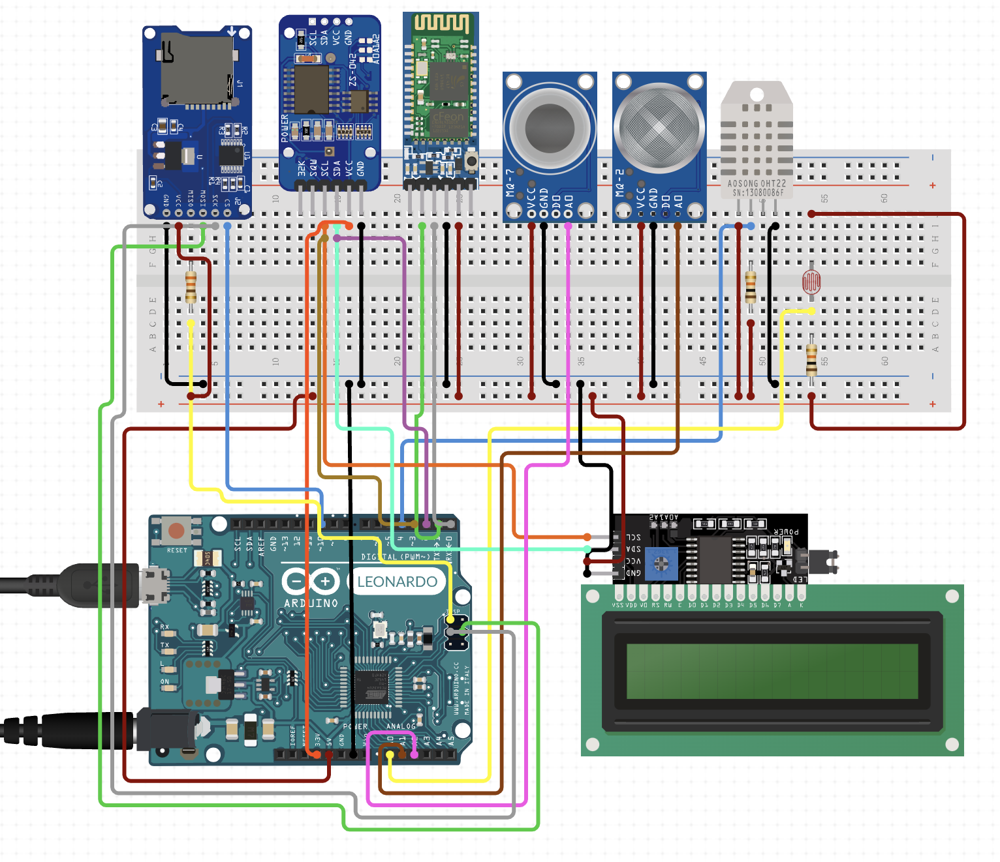

# Home Automation With Arduino

## Parts

- Arduino Leonardo with Headers
- LCD Display Screen 16x2 I2C
- Micro SD Card Memory Shield Module
- 330 Ohm Resistor
- DS3231 Precision RTC Breakout
- Wall Adapter Power Supply - 12VDC 2A
- HC - 05 Bluetooth Serial Module
- Carbon Monoxide Sensor - MQ-7
- Methane, Butane, LPG and Smoke Gas Sensor - MQ-2
- DHT22/11 Humidity and Temperature Sensor
- 10K Ohm Resistor
- LDR (Mini Photocell)
- USB micro-B Cable - 6 Foot
- BreadBoard
- Jumper Wires Pack - M/M
- Jumper Wires Pack - M/F

## Schema

The parts and the connections are shown below

